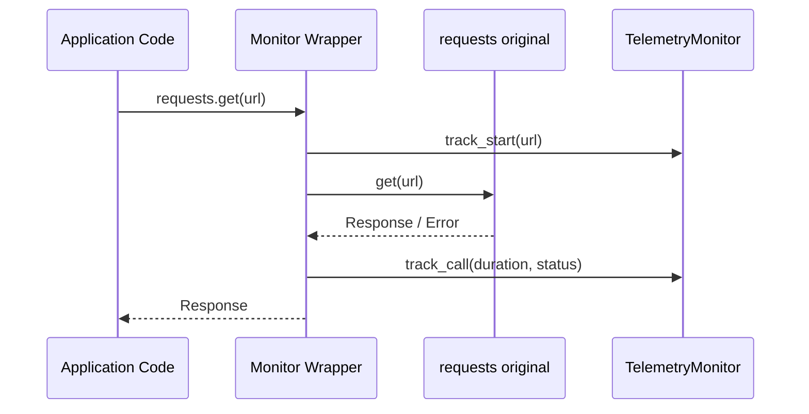

# AutoHeal-Py Technical Architecture

This document provides a deep dive into the internal engineering of the AutoHeal-Py framework.

## 1. Zero-Touch Instrumentation (Monitor)

The core innovation of AutoHeal-Py starts with the `TelemetryMonitor`. It uses **Runtime Monkey Patching** to intercept outgoing HTTP calls without requiring any changes to the application's source code.

### Interception Logic
When `install_monitor()` is called, the framework:
1.  Saves the original `requests.get`, `requests.post`, etc. functions.
2.  Replaces them with custom wrappers that:
    -   Extract the service identity (hostname) from the target URL.
    -   Measure execution time.
    -   Capture status codes and exception messages.
    -   Call the original function to perform the actual network request.
    -   Record the metrics in a thread-safe `deque`.

## 2. Autonomous Healing Loop (Agent)

The `AutoHealAgent` implements a **Control Loop** (Sense-Analyze-Act-Adapt).

| Phase | Component | Action |
|---|---|---|
| **Sense** | `Monitor` | Collects live telemetry (latency, error rates). |
| **Analyze** | `Detector` | Compares metrics against thresholds to determine health state (DEGRADED, SLOW, CRITICAL). |
| **Act** | `Injector` | Dynamically applies a recommended resilience pattern (Retry, Circuit Breaker, Timeout). |
| **Adapt** | `Agent` | Monitors recovery and removes patterns after the `grace_period`. |

## 3. Dynamic Pattern Injection (Injector)

Unlike typical frameworks that require decorators at compile-time, AutoHeal-Py can inject protection **at runtime**.

- **Implementation**: The `PatternInjector` creates a closure (wrapper) around the target function.
- **State Management**: It maintains a registry of `InjectionRecord` objects to track which services are currently protected.
- **Thread Safety**: All injection maps are protected by threading locks to handle concurrent microservice traffic.

## 4. Resilience Patterns SPEC

### Circuit Breaker
- **States**: `CLOSED`, `OPEN`, `HALF_OPEN`.
- **Trigger**: Reaches `failure_threshold` within sliding window.
- **Self-Healing**: Automatically transitions to `HALF_OPEN` after `recovery_timeout` to probe service health.

### Exponential Backoff Retry
- **Mechanism**: `delta = base^attempt + random_jitter`.
- **Protection**: Prevents "thundering herd" effect on recovering services.

### Timeout Guard
- **Mechanism**: Thread-based interrupt or signal (depending on OS compatibility).
- **Benefit**: Frees up local worker threads by failing-fast on zombie connections.
